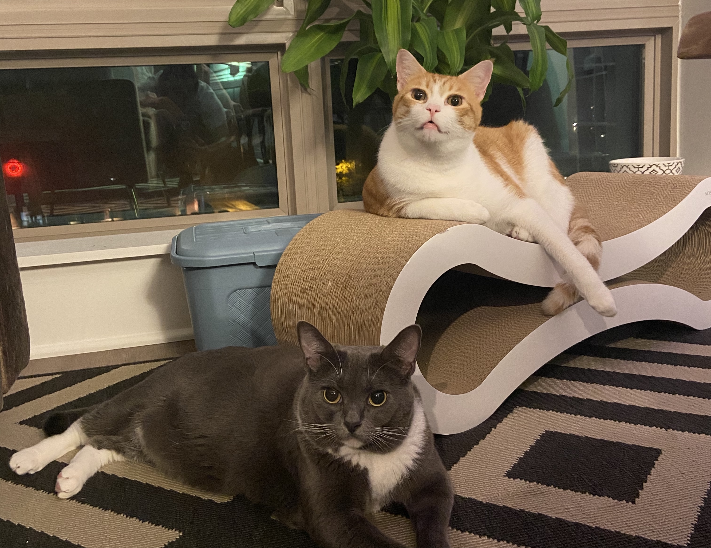

Hi, welcome to my page! I am a first year MPH student at Columbia Mailman School of Public Health. I studied Epidemiology with a certificate of Applied Biostatistics and Data Science. 

I have two cats, they are Piper and Jeffery. They are both 2 years old and they are currently living in Chapel Hill, NC.

