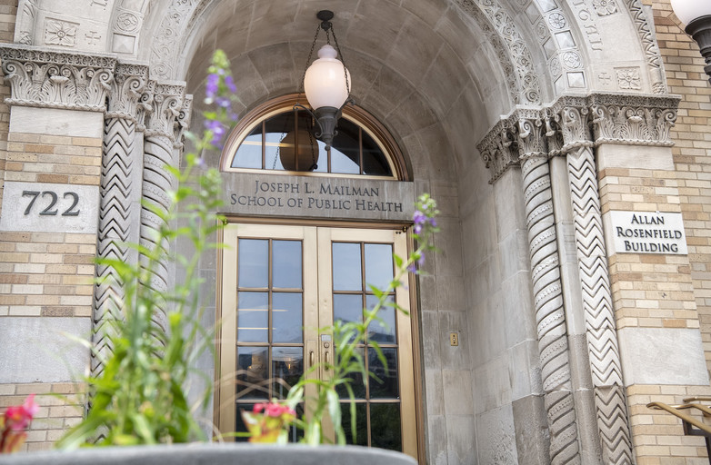

----------------------------------------

# Introduction

Hi, welcome to my page! My name is Ziyu (she/her/hers). I am a first year MPH student at Columbia Mailman School of Public Health. I studied Epidemiology with a certificate of Applied Biostatistics and Data Science. I have more than 4 years experiences in visual arts and digital designing. I’ve also have experiences with healthcare marketing and health economics.   

---------------------------------------

---------------------------------------

# My professional experience

This is my 
[personal website](https://ziyu0303.github.io). You can find my work experiences and projects there.

-----------------------------------

# My nyc airbnb dataset dashboard
I did 3 interative plots showing the nyc airbnb price and location in Queens and Bronx.

Here's the link to my 
[dashboard](Dashboard.html)  

-----------------------------------

# My cats

They are 
[Piper and Jeffery](My_life.html) 

-----------------------------------

